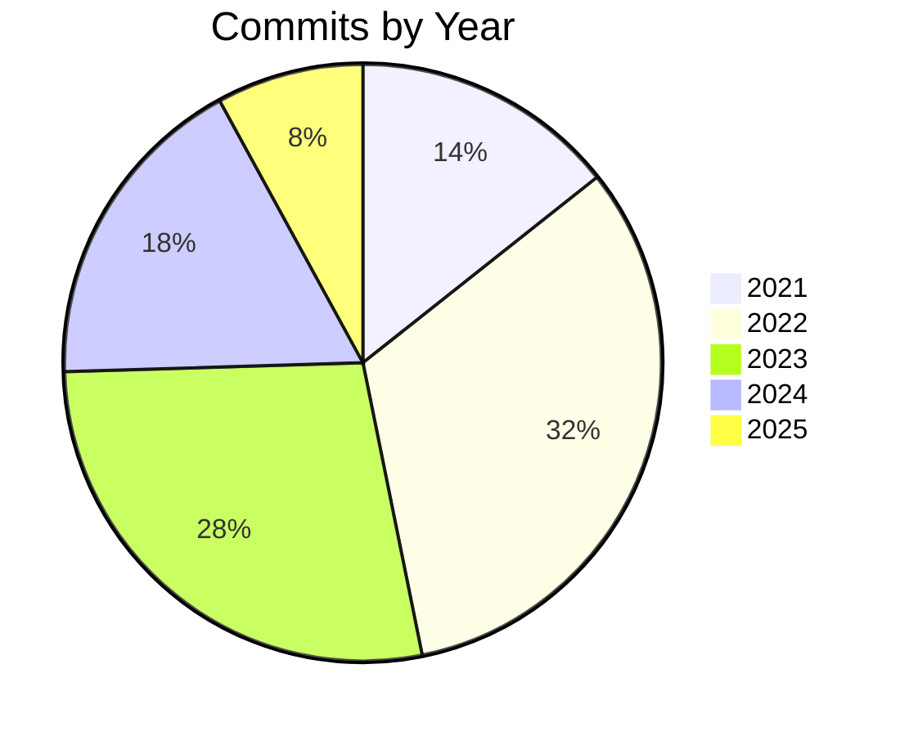

# Digest Skill

## Description

Creates or updates the `digest.md` document in the repository root with key metrics and information about the solution.

## Trigger

When the user asks to "digest", "create digest", "update digest", or "solution summary".

## Instructions

Generate a `digest.md` file in the repository root with the following sections.

### Procedure

1. Read source files to understand the solution's purpose.
2. Identify all programming/markup languages used in the solution (scan file extensions, exclude `obj/`, `bin/`, `.git/`, `.vs/`, `.vscode/`, `.kiro/`).
3. Count modules (source files) broken down by language.
4. Run `dotnet test` and extract the total unit test count from the output.
5. Run git commands to gather development history:
   - `git rev-list --count HEAD` for total commits
   - `git log --reverse --format=%aI` (first line) for first commit date
   - `git log -1 --format=%aI` for last commit date
   - Calculate the elapsed time between first and last commit
6. If the project has been in development for 2 or more years, gather commits per year using `git log --format=%ai` and count commits grouped by year. Include a Mermaid pie chart in the output showing the number of commits for each year.
7. Write `digest.md` using the Output Format below.

### Output Format

```markdown
# Solution Digest

## Summary

<2-3 sentence executive summary of what the solution does.>

## Languages

| Language | Extension(s) |
|----------|-------------|
| C# | .cs |
| JSON | .json |

## Modules

| Language | Count |
|----------|-------|
| C# | 14 |
| JSON | 2 |

## Unit Tests

| Metric | Value |
|--------|-------|
| Total tests | 73 |
| Framework | xUnit |

## Development History

| Metric | Value |
|--------|-------|
| Total commits | 42 |
| First commit | Monday, 15 January 2024 |
| Last commit | Thursday, 10 July 2025 |
| Days | 541 |
| Weeks | 77 |
| Months | 17 |
| Years | 1 |

## Commits by Year



### Rules

- Only include languages that have source files in the project (exclude generated/build output).
- For the Modules section, count only source files — exclude config, data files, and generated output.
- For Development History duration rows (Days, Weeks, Months, Years): only include a row if its value is greater than zero.
- Weeks is calculated as `floor(days / 7)`.
- Months is calculated as `floor(days / 30)`.
- Years is calculated as `floor(days / 365)`.
- Write the report to `digest.md` in the repository root, overwriting any existing content.
- Only include the "Commits by Year" Mermaid pie chart section if the project has been in development for 2 or more years (i.e., `floor(days / 365) >= 2`). Each slice label is the year, and the value is the number of commits in that year.
